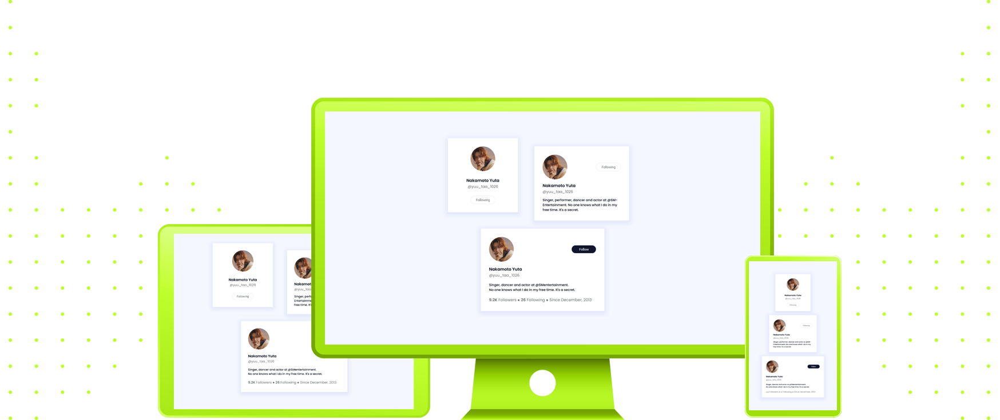

 
 

|         |               
| :-------------:|
|   |
| **Challenge #07:** Social Profile   | 
| **Original Project:** [🌐](https://github.com/malunaridev/Challenges-iCodeThis/blob/master/7-social-profile/assets/Readme-files/example.jpeg?raw=true) / **My Code:** [📄](https://github.com/malunaridev/Challenges-iCodeThis/tree/master/7-social-profile) / **Live Preview:** [🌐](https://challenge-ict-7-social-profile.netlify.app/)  

 
 

The challenge #07 was a easy one, and there was not much to learn about. I think this is a good sign, meaning that I have less and less to search every time. 

 
 
 

- HTML
- CSS

 
 
 

|  Validator  | Passed |
| ------------- | :-------------: |
|[Markup Validation Service](https://validator.w3.org/) - <em>w3.org</em> |   |
|[CSS Validation Service](https://jigsaw.w3.org/css-validator/) - <em>w3.org</em> |   |

 
 
 

I have learned from a friend the trick about using <code>position: relative</code>, then repositioning the div the way I wanted. It turned out to be really useful when you already have a layout (as an example, the <code>display:flex</code>) but wants to literally "unalign" something.

 
 
 

